# System Analysis and Design SAD

# Table of Contents
- [SDLC](#sdlc)
- [C2 System Planning](#c2-system-planning)
  - [System Request](#system-request)
  - [Preliminary Investigation](#preliminary-investigation)
  - [Feasibility Study](#feasibility-study)
    - [Technical Feasibility](#technical-feasibility)
    - [Social and Operational Feasibility](#social-and-operational-feasibility)
    - [Economic Feasibility](#economic-feasibility)
    - [Costs](#costs)
    - [Benefits](#benefits)
- [C3 System Analysis I: Requirements Analysis](#c3-system-analysis-i-requiements-analysis)
- [C4 System Analysis II: Fact Recording](#c4-system-analysis-ii-fact-recording)
- [C5 System Design](#c5-system-design)
- [C6 DB Management](#c6-db-management)
- [C7 Procedural Design](#c7-procedural-design)
- [C8 Programming * Tools](#c8-programming-and-tools)
- [C9 Testing & Documentation](#c9-testing--documentation)
- [C10 System Implementation I](#c10-system-implementation-i)
- [C11 System Implementation II](#c11-system-implementation-ii)
- [C12 System Operation & Maintenance](#c12-system-operation--maintenance)
- [C13 System Development Methodology](#c13-system-development-methodology)

# SDLC
1. Request
2. Planning
3. Analysis
4. Design
5. Development
6. Implementation
7. Operation & Maintenance

# C2 System Planning

## System Request
> A formal request to give IT department job
### Causes
- Change in objective
- Got new objectives
- Current system got problem
- User's suggestion
### Result
- New system
- Enhanced system
### Sources
- Top management
  - Need new info
  - Need to meet new objective
- User's needs
  - Need new feature
  - Unhappy with current system
- External sources
  - Got new technology
  - New legal policy
- Existing system problem
- IT department find job for their own
### Types of Improvements
- Improve performance
- Better service
- Quality info
- Effective control
  - related to validation
- Reduce cost
  - current system maintenance cost too high

## Preliminary Investigation
- To gather info
- Done after system project is approved

## Feasibility Study
- Determine new system feasible or not
- Benefit > cost
- Identify objective
- Determine requirements
- Determine Scope
- Estimate cost & benefits
- Estimate time
- Identify constraints (budgets)

### Technical Feasibility
- Software, hardware, performance (are they doable)
- Issues
  - Can have many users?
  - Can process many inputs?
  - Can output fast enough?
  - Response time fast?

### Social and Operational Feasibility
- New structure can be used?
- Will it have extra cost? If so, can the benefits cover it?
- Issues
  - Employee
    - Skill
    - Motivation
  - Structural Changes
  - High costs
    - Direct
    - Indirect

### Economic Feasibility
- Idenitfy cost and benefit
- Issues
  - Technique: Technique used to compare correct or not
  - Selection: Use which options
  - Decision: Should the project be stopped

### Costs
- Hardware & Software
- Installation
- Development
- Personnel
- Operating
- Intangible
  - Learning curve
  - Incompatibility
  - Staff can't work well

### Benefits
- Tangible
  - Reduce operation cost
  - Reduce staff cost
  - Increase sales
  - Reduce stock holding
  - Reduce mistakes
  - Improve productivity
- Intangible
  - Company image
  - Customer satisfaction
  - Accurate management
  - Staff motivation
  - Updated info
  - Security
  - Faster response time

# C3 System Analysis I (Requiements Analysis)
- Defines required functionality

## Fact gathering
- From: End Users
- Quality: Analyst need know rule and flow in that area
- What
  - Rules
  - Processes
  - Work locations
  - User activities
  - Interfaces

## Fact Gathering Techniques
### Interview
- Face to face
- Meeting (formal)
- Documented feedback to user for confirmation
- Advantages
  - Read body language
  - People talk more freely
  - Build relationship
  - Carify facts easier
  - Can get cooperation
- Disadvantages
  - Waste money, time
  - Interviewer need to be skilled
  - Need to contact people to be interviewed

### Questionnaires
- Used when many users or international
- Used when anonymity is important
- Advantages
  - Answer at any time
  - Respond anonymously
  - Get response from large group of people
- Disadvantages
  - Hard to design
  - Cannot clarify questions
  - Not everyone will respond

### Observation
- Analyst watch the system in use
- Need make arrangements in advance
- Advantages
  - Offer new perspective to see the problem yourself
  - Cross-check
  - See environment
- Disadvantages
  - Waste time
  - Need understand procedure first
  - Workers get nervous under observation

### Existing Docs
- Analyse previous docs
- Advantage
  - Procedures are detailed
- Disadvantages
  - Docs can be outdated
  - Docs need to be selected carefully

### Joint Application Development
- A group of user together discuss requirements, issues and problems
- Workshop documented

### Background Research
- Review journals
- Attend meetings
- Visit similar places

### Prototyping
- Use 4GL / CASE tools
- Make it to user so they can provide further feedbacks
- Fast, productive

## Functional Requirements
- What the system need to provide
- Describe
  - Input
  - Output
  - Process
  - Data
- Eg.
  - Storage requirements
    - Fast retrieval
  - UI requirements
    - Auto fill
  - Processing Requirements
    - Accept orders
  - Control Requirements
    - Data validation

## Non-functional Requirements
- Eg.
  - Interface with other system
  - Audit trail records
  - Legal (license, law)
  - Archiving
    - after some time, save to somewhere else
  - Backup
    - make copy
  - Reliability
  - Usability
    - Learnability
      - how long to learn
    - Efficiency
      - how fast to perfomr
    - Memorability
      - how long they can remember
    - Errors
      - how many errors made
    - Satisfaction

# C4 System Analysis II (Fact Recording)
> A picture is worth a thousand words`
## Data Flow Diagram
- Help understand flow and process
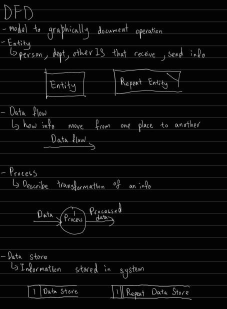
- Rules
  - Process
    - Input must be transformed to output through process
    - Process need got number labeling
    - Verb + Noun
  - Data flow
    - Must have arrows
    - Label the arrows
  - Data Store
    - Must got number
  
  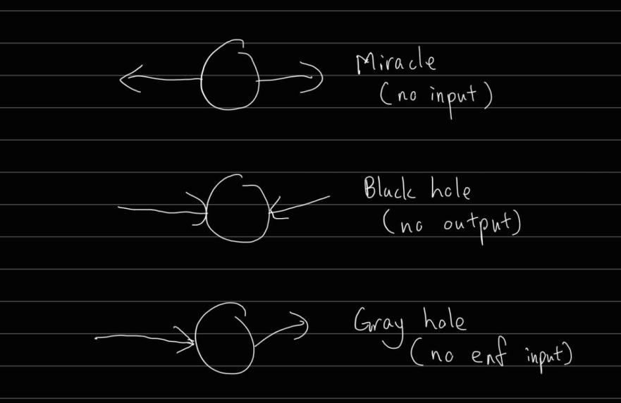

## ERD
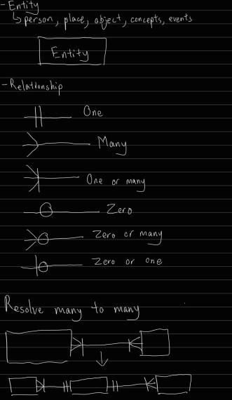

## DataBase Design Language
ENTITY(<ins>PrimaryKey</ins>, NormalField,ForeignKey*)

# C5 System Design
- Show how system will fulfill what it is supposed to do
- Overall plan or model with specifications

## Importance
- Future maintenance
  - Provide roadmap & docs for maintenance staff
- Quality
  - Find out how the software should behave to have high quality
- Testing
  - Easier to test
  - You know what to test for
- Communication
  - Communication medium between designers of different sub-systems
- Implementation
  - Translate client's requirements into software

## Physical vs Logical Design
- Physical
  - System Design phase
  - Defines actual process of
    - Entering: UI
    - Verifying: Validation
    - Storing Data: DB
- Logical
  - System Analysis phase
  - Define functions & features
  - What must take place, not how do it

## Architectural Design
- Provide an overall picture for the objective
  - Have better dev process
- Show all the modules and control relationship between them
- To develop a modular program structure

### System Structure Diagram
- How different modules relate to each other in the whole system
- How control information flow between them
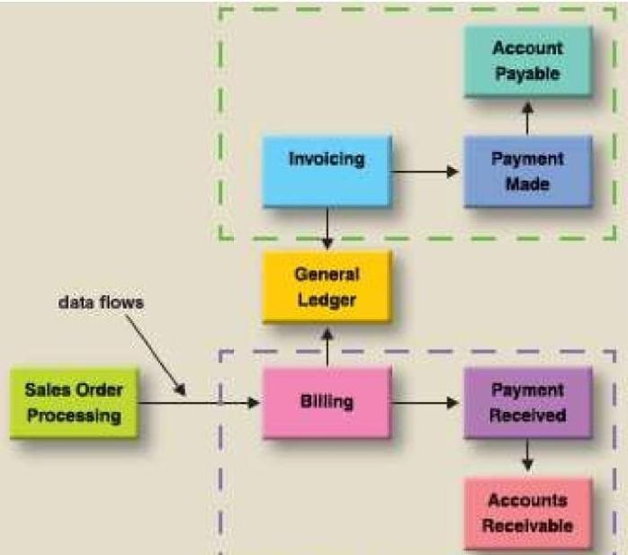

### Functional Decomposition Diagrams
- FDDs, structure charts
- Top down representation of a function/process
  - Can use DFD as a guyde
    - Diagram 0 as whole system
    - Low-level DFD as modules
- Break down system into sub-systems
- Used in
  - Requirements modeling
  - App development
- 3 Steps
  - Define system into main processes
  - Identify activities that need to run to do the process
  - Break the activities into smaller tasks

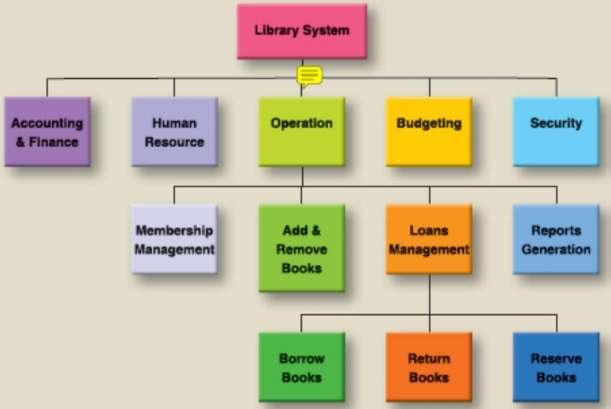

## User Interface Design
- How user interact with the system
  - Hardware
    - Keyboard
    - Mouse
    - Touchscreen
    - Scanner/Reader
  - Software
- Types of UI
  - Command Line Interface
  - Menu-Driven Interface
  - Improved Menu Interfaces
    - Pop-up
    - Pull-down & nested menus
  - Toolbar & Icon-based Interfaces
  - Form-based Interface
  - Natural Language Interaction
    - Allow user to enter questions and commands
    - Answer in natural language
    - Eg. Google Assistant
- UI Design Interfaces
  - Consistent Design
    - Similar operation activated in the same way
  - Familiarise Users
    - Use terms and concepts from experienced users
  - Guide users
    - Provide hints and tooltips
    - Give context-sensitive user guide and assistance
  - Reduce surprise
  - Enhance Recoverability
    - Let user recover from errors

### User Friendliness Characteristics
- Ease of Data Entry
  - Data entry screen in same logical error as the input form
  - Clearly Designed
  - Clear title of the fields
  - Provide data validation checks
- Meaningful error message
  - Report errors
    - simple
    - unique
  - Suggest actions
- Help Facilities
  - On-screen help
  - Hypertext & Hypermedia
  - Context sensitive
    - Provide help when user unsure or unable to perform something or made an error
    - Provide example how the command can be used
    - Suggest correct alternative that the user has used
- Consistent with other modules
  - All modules look, feel, operate in the same way
  - Same shortcut key to do the same thing
  - Reduced training time
- Adherence to Industrial Standards
  - Use commands & techniques that are used in other softwares in the same industry
  - Take advantage of "transferable" skills, increase productivity
- Escapability
  - Let user escape from their mistakes
  - Undo, Delete
- Other features
  - Pull-down list
    - A list of accepted values provided to the user to choose from
  - Default values
    - Set default values when the data of the fields can be predicted

### Input Design
- Produce cost effective method of input
- Achieve highest level of accuracy
- Ensure input acceptable and understood by staff and users
- Consideration
  - Volume
    - If large volume, use automated
  - Frequency
    - If low frequency, can use keyboard
  - Medium
    - Use what
  - Accuracy
    - Do checks
  - Speed

## Verification and Validation
- Verification
  - Before input into system
  - Use human eyes
- Validation
  - During input
  - Check for accuracy before process the data

### Types of Validation
- Format Check
  - Input follow a certain format
- Existence Check
  - Does the record exist in DB
- Null Value Check
  - Is the input field empty
- Data Type Check
  - Data type, alphabets, integers
- Size Check
  - How many characters
- Limit Check
  - Input *less than* or *more than* a limit
- Range Check
  - Input between a *min* and a *max* number

## Output Design
### Factors affecting
- Purpose
- Frequency
- Volume
- Output Medium
- Content and Format
### Types
- Screen
- Audio
- Printer, plotter
- Computer Output Microfilm
- Mobile Devices
- Others
  - ATM, POS terminals

## Reports
### Guidelines for Creating
- Functional Area
  - Designed for its own dept.
  - Sales Analysis Report for Sales Dept
- Level of Staff
  - Designed for the staff at that level
- Purpose of Report
  - Contain informations that are relevant to the report

### Types
- Detail Rerports (Sorted, Categorized)
  - Contain *every single items*
- Summary Reports
  - Total and Subtotals
  - Can be graphs or charts
- Exception Reports
  - *Filtered items* using certain criteria

### Attributes of a Good Report
- Appropriate Report Title
  - Good name
  - Revision / Version
  - Length (not too long)
- Pleasing Layout
  - Labels for all data
  - Good layout
  - Appropriate spacing
- Meaningful Context
  - Presentation
    - Presented in a way useful to the users
  - Relevant
    - Put in relevant data only
- Others
  - If multi page and display on screen, provide *navigation*
  - Tell user report has finished

# C6 DB Management
## Concepts
- Database
  - Have files/tables
- File (Table)
  - Collection of related datas
- Records (Rows)
  - Collection of related items of that data
- Fields
  - Contain one logical unit of data

## Key Fields
- Used to differentiate records
- Primary Key
  - Uniquely identify a particular record
- Concatenated Key
  - Composite Key
  - Combine multiple foreign keys
- Foreign Key
  - Match primary key of a table to another table to form relationship

## Steps to Create DB
1. Create initial ERD
2. Assign Fields to entities
3. Verify
  - Resolve many to many relationship
4. Relate entities using foreign key
5. Normalisation
6. Create Data Dictionary

## Normalisation
- 1NF: No repeating group
- 2NF: No partial dependencies
- 3NF: No transitive dependencies

## Data Dictionary
- Format
  - Field name
  - Field length
  - Field type
  - Alias (nickname)
  - Field content description
  - Supplementary info
- Usage
  - Analysis
    - Help analyst organise info about data
    - Help communicate with user
  - Design
    - Generate records and formats

## Code Design for Primary Key
- Sequence Codes
  - Codes formed by numbers/letters with no additional info
- Block Sequence Code
  - Seperate info into different classes
  - 1XX for floor 1 rooms, 2XX for floor 2 etc
- Significant Alphabetic Codes
  - Differentiate item using abbreviations
- Significant Digit Codes
  - Differentiate item using a series of digits
- Derivation Codes
  - Combine data from attributes

### Good Code Characteristics
- Unique
- Flexible
  - Easy to modify
- Concise
  - Use less space
- Stable
  - No need update frequently
- Expandable
  - Allow for growth
- Simple
- Meaningful
  - Easy to remember

# C7 Procedural Design
## Program Flowchart
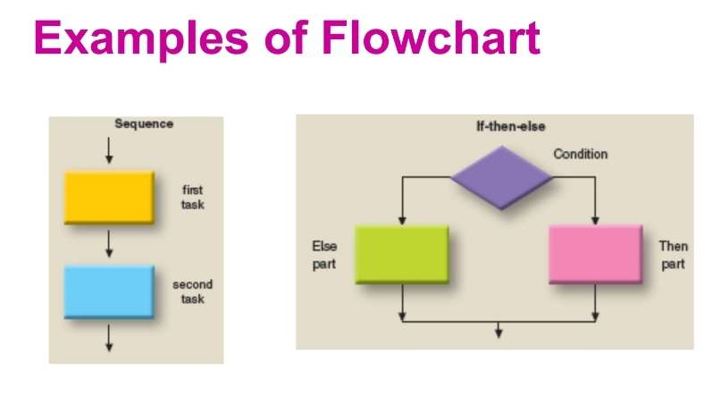

## Box Diagram
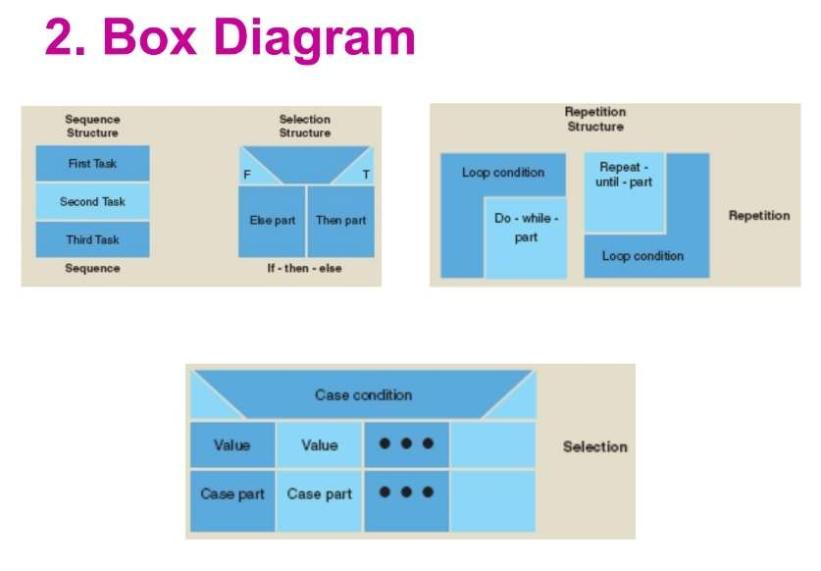

## Structured English
- Describe operations like spoken english
- Weak
  - Limited, restricted vocabulary
  - Very long and confusing
- Strong
  - Resembles some programming language
  - Programmer easy to understand
  - User easy to follow

## Pseudocode
- Borrows commands/vocabs from real programming language
- Borrow style and syntax from programming and natural language
- No fixed standard
- Programmer have more time to focus on logic and algorithm
- Easy to use
- Disadvantages
  - Double coding
  - Not flexible
  - Not good at control structures

## Decision Table
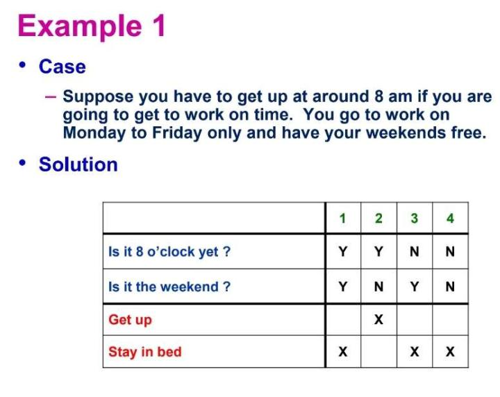
- Advantages
  - Solve complex problems
  - Design test scripts

## Decision Tree
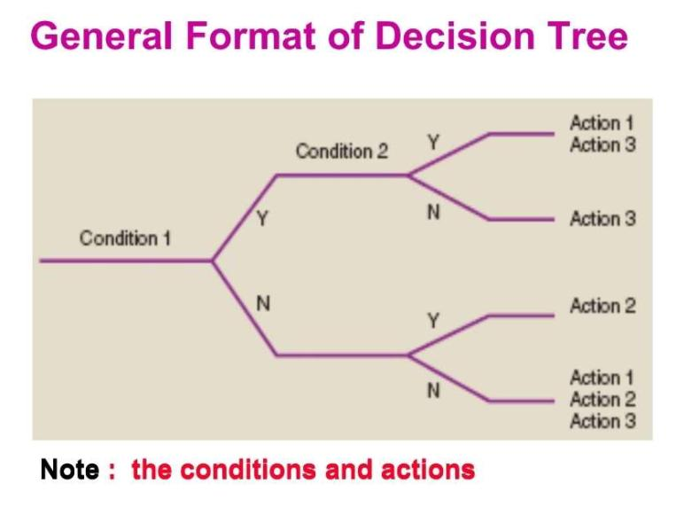

## System Design Specification
- Prepared by System Analyst
- Set of documents to record details of a design

## Good Design Characteristics
- Modularity
  - Higher better
  - Separate system into smaller sub-systems
  - Every module perform only one task
- Coupling
  - Lower better
  - How much one module depend on other modules
- Cohesion
  - Higher better
  - How the instructions (codes) in one module relate to each other to perform a single task
  - Can imagine it as internal glue

# C8 Programming and Tools
## MISC (Unimportant front 8 slides)
### Program Design
- Review
  - See if changes are needed
- Tools
  - Flowchart, pseudocode
  - Develop logic

### Structured Programming
- History (no please, go away)
- Translate system into well- structured modules

### Basic Control Structures
- Sequence
- Decision
- Repetition

## Code Le Program
- Write instructions to implement the specifications using a suitable language

### Choose Programming Language (Criterias)
- Purpose of that language
- Familiarity with that language
  - programmers familiar or not
- Features of that language
- Cost
  - Purchase cost
  - License fees
- Support tool
  - How easy the programming language can be used
  - **(Not in notes, own understanding)** Degree of support of that language, helpful community
- Performance

### Generation of Languages
- 1GL
  - Machine Language
- 2GL
  - Assembly Language
- 3GL
  - High level language
- 4GL
  - Very high level languages
  - User friendly
  - Many supporting tools
  - Non-procedural
    - **(Not in notes, own understanding)** Code flow can jump here jump thr
  - Eg.
    - Query Language
    - Report Generator
    - Application Generator
  - Advantages
    - Easy maintenance
    - Cost-effective
      - Less dev time
    - Generate documentation

## CASE Tools
- Computer Aided Software Tools
- Help improve analyst productivity

### Terms & Concepts
- Modeling Tools
  - Model system graphically
  - DFD, structure charts etc
- Documentation Tools
  - Check new entry and add to DB
  - Check incomplete info in forms, reports
- Engineering Tools
  - Forward Engineering
    - Translate functions into applications by adding code
  - Reverse Engineering
    - Convert existing application back into code, DFD etc.

### Development Tools
- Application Generator
- Report Generator (Design forms, generate forms)
- Screen Generator (Design UI, generate UI)

### Benefits of CASE Tools for Models
- Easy to draw, store, update model
- Ensure all model follow the same standard
- Cross referencing for consistent view of different models
- Data dictionary
- Auto generate physical files and data structures from the entities

### Advantages of CASE Tool in Sys Dev
- Draw descriptive diagrams
  - DFD
- Maintain diagrams
- Force IT Personnel to follow development standards
- Maintain data dictionary
- Prototyping
- Code Generation

# C9 Testing & Documentation
## Testing Le Program
- Program translation
  - Program -> executable machine codes
  - Identify syntax errors

### Desk Checking
- Read/inspect the program, review the logic visually or mentally
- Structured walkthrough
  - Developer present his module to a review team
    - System Analyst
    - Auditors
    - Users
    - Chairman, Secretary
  - Detect errors
  - Adherence to standards
  - Verify it satisfies requirements
  - Use feedback to improve the module

### Unit Testing
- Make sure each unit functions properly on its own
- Eliminate logic, syntax, execution errors
- Programmer do the test
- Use dummy data
- **Stub Testing**
  - Stub: A piece of code to emulate the missing module
  - Test programs that interact with other programs or files

### Link Testing
- Test many program that interact with each other
- Ensure data passed correctly
- Programmer do the test
- Use dummy data

### System Testing
- Test all the programs together
- Ensure all programs work properly as a whole
- Testers:
  - End Users
    - Prepare source documents
    - Enter data
    - Select report for output
  - Operations Group
    - Runs the programs according to the operation docs
  - Project Team
    - Ensure system function correctly
- Use real data provided by end users
- Scope
  - Interface
    - Check if it interfaces with other systems correctly
  - Business functionality
    - Functions defined in analysis & design implemented correctly
  - Performance (Load, Stress, Volume)
    - Explore limits of performance
    - Network traffics, number of users
    - Use specialised simulation software
    - Test can meet defined performance with the predicted data volumes, network traffics and number of users
    - Importance
      - Get indication of performance limits
      - Predict performance requirements
      - Explore potential effects of a large data volume
  - Usability
    - Consistency
    - Adherence to industry standards
    - Clarity and usefulness of error messages
  - Stability and reliability
    - Error reporting messages correct and appropriate

### User Acceptance Test (UAT)
- Test working system meets defined requirements
- Use realistic data
- Find undetected bugs and errors
- Alpha test
  - In house
  - Simulate testing in real environment
  - Programmers test
- Beta test
  - Selected customers at their own premises
  - Expose to real environment
- Parallel Test
  - Old and new system run concurrently

### Automated Testing Tools
- Save time
  - Create data and simulate a number of users
- Predict performance
  - Simulate large number of users
- Diagnostics
  - Allow tester to feedback to systems designer

## Documentations
### End User Documentation
- System Analyst & Programmers prepare
- End users & Trainers use
- Teach user how to use, self training
- Contain input, output, procedures, error reports

### Operation Documentation
- System Analyst prepare
- Operations Group use
- Help operations group operate the system
- Contain setup procedure, security procedure, recovery procedure

### Program Documentation
- System Analysis stage until testing
- System Analysts prepare process descriptions
- Programmers write comments
- Programmers use
- Helps maintenance
- Contains flowcharts, codes

### System Documentation
- System Analysis start, System Design complete
- System Analyst prepare
- Designers, programmers use
- Help describe features of an IS and how to implement
- Contain DFD, screen layouts, data dictionary, system request form

# C10 System Implementation I
## Installation
### Install PC & Peripherals
- Hardware
  - Site
  - Power supply
  - Furniture
  - Communication
  - Cable
  - Noise
    - Isolate noisy equipments
- Software
  - Installation
  - Pre-loaded
  - Software Registration
  - Software Back-ups
  - License

### Site Selection
- Existing/new building
- Factors
  - Space for computer
  - Distance to principal user departments
  - Access for equipments
  - Room for expansion

### Site Preparation
- Appropriate furnishings
- Special electricity supplies
- Air conditioning
- Prevent generation of static electricity
  - Raised floor, false ceiling
- Fire protection devices

### Standby Equipment
- Standby generators
- Standby computers

## File Conversion & Creation
### Objectives
- Produce file on a specified medium
- Produce file free from errors
- Ensure process is completed and success

### Data conversion
- Convert data from old to new systems

### Data Creation
- Create new data for data that is not found in old system
- Data must be validated

### Methods
- Automated
  - Different format converted into standard format first
    - ASCII
    - ODBC
      - Open DataBase Connectivity
      - Standard protocol to share among different DBMS
- Manual Keying

### Data Conversion Problems (Comp-to-Comp)
- Technical incompatibility
  - Run on different hardware
  - Manual keying into new system to solve
- Problems of new data fields
  - Data fields not on the old system
- Problems of matching data fields
  - Fields are combined or split up
  - No exact match of the fields
- Problems of new data files
  - Old system dh values, so need to determine them
- Problems of different field lengths

### Data Conversion Problems (Manual)
> TBH all these I not very understand
- Set up of master files
- Entry of system derived files
- Lack of historical data
  - Some features like generate annual report have no use as the system is new and dh the old datas

### File Conversion Plan
- Set up timetable
- Carry out dummy run
  - Test run with dummy data
- Decide cut-off date
- Train relevant staff
- Run data validation
- Try plan for quickest changeover

# C11 System Implementation II
## Training
### Purpose
- Facilitate user involvement
  - Get users involved with the new system
- Familiarise Users
  - Docs & system functions
- Allow User Participation in Implementation Effectively
  - Give users skills to handle tasks effectively
- Offer opportunity to spot and correct errors

### Methods
- #### Instructor-Based
  - Got an instructor to explain & demo skills and procedures
  - Options
    - [Public Courses](#public-courses)
    - In-House Training
      - [External Instructor](#in-house-training-external-trainer)
      - [Internal Instructor](#in-house-training-internal-trainer)
  - Advantages
    - Easy to develop and conduct
    - Trainer is an expert on that subject
  - Disadvantages
    - Logistic arrangement difficult
    - Training more frequent, higher cost
- #### Computer-Based Training (CBT)
  - On-demand training (use PC)
  - Advantages
    - Flexible time and pace
    - No trainers needed (low ongoing costs)
    - Able to track participants' progress
  - Disadvantages
    - Hard to develop
    - High initial investment
- #### Podcast
  - Multimedia or simple audio files
  - Advantages
    - Can play at any time and place
- #### Webinars
  - Web + Seminar
  - Interactive training with instructor
  - Non-interactive -> pre-recorded
  - Advantage
    - Attend training when needed
- #### Self-Training
  - Instructions and user manuals given to users
  - Advantage
    - Easy to develop
    - Low initial cost (assume no software)
    - Less logistic requirements
  - Disadvantage
    - Not effective
    - Hard to determine how complete is the training
- #### Online Help / Tutorial
  - Let user get help when performing the task
  - Advantage
    - On-demand training
  - Disadvantage
    - Hard to develop
    - High initial investment
- #### Case Studies & Exercises
  - Classroom tuition + CBT
  - Advantages
    - Simulate real env
    - Easy to produce
    - Help users understand how new system will work
- #### Public Courses
  - Provider: Hardware & Software Vendor
  - Venue: Vendor's site
  - Trainer: Vendor's Trainers
  - Mode: All customers of the vendor attend together
  - Logistics: Arranged by vendors
- #### In-House Training (Internal Trainer)
  - Provider: Company
  - Venue: Internal (lab) || External (hotel)
  - Trainer: Company's own trainers
  - Advantages
    - Better control (time, cost, quality)
    - Can check how effective is the training after complete the training
- #### In-House Training (External Trainer)
  - Provider: Vendor (if large number of people)
  - Venue: Client decide
  - Trainer: Vendor's trainer
  - Advantages
    - Vendor make tailored training to suit to the client's unique environment
    - Can be slightly more flexible
  - Disadvantages
    - Client need to make logistic arrangements on their own

### Deliver Effective Training
- Training Objectives
  - Find out what an organisation wants to achieve
- Training Needs Analysis
  - Find out gap between *what they know now* VS *what they need to know*
- Course Design
  - Duration
  - Content
  - Trainers
- Conduct Training
  - Use appropriate methodology
  - Arrange logistics
- Assessment
  - Check if the training is effective

## System Conversion
### Parallel Run
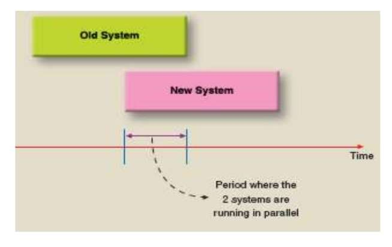
- Run both system simulteanously for a certain period
- Use same inputs for both systems
- Compare both system output to correct errors
- Old system stop only when new system is satisfied
- Appropriate Situations
  - Large and risky systems
  - Lack of confidence
  - Resources Sufficient
  - Systems are comparable
    - Old and new systems have not much difference
- Advantages
  - Standby system
    - Use old when new fails
  - Verification
    - Compare old vs new
  - Promote user confidence
  - Consolidate training
- Disadvantages
  - High cost
  - Difficult to cross-check errors if the outputs have difference
  - Not comparable
    - Old and new system is not very similar
  - Risk of failure
    - Could fail both sides

### Direct Changeover (Big Bang)
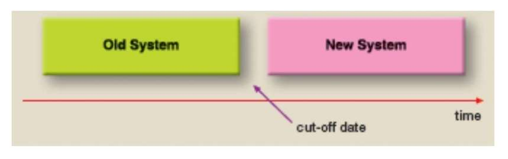
- Choose suitable cut-off date
- Stop old, run new
- Only when old and new is totally different and new has been tested entirely
- Appropriate Situations
  - Small System, Low risk of failure
  - Well trained, confident staffs
  - Not comparable
    - Old and new totally different
  - Reliable systems
  - Resources are limited
- Advantages
  - Flexible changeover time
  - Cheaper
  - Maintain morale confidence
  - Quick return on investment
    - Use system to benefit early
- Disadvantages
  - Risky
    - Cannot fallback to old system
  - Increase cost on unexpected places
    - Cost for comprehensive training
    - Cost for well organised and supervised implementation
  - Difficult to detect errors
    - No comparison available to be made

### Pilot Run
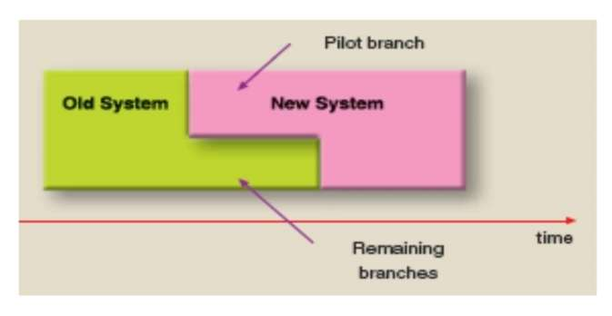
- One branch is selected as the pilot branch
- Risk minimised
- When pilot branch success, remaining branch will change
- Pilot branch can choose parallel run or direct changeover
- Advantages
  - Localised errors
    - Errors restricted to pilot branch only
  - Cheaper
    - Than full parallel run
  - Reduce risk of failure
    - Only one branch instead of whole organisation
  - Promote user confidence
    - Pilot branch success boost confidence of other branches
  - Won't overstrain IT personnel
- Disadvantages
  - Overworked
    - Need to work for both old and new system in the pilot branch
  - High investment
    - Many resources channeled into pilot branch to make sure it success
  - Not representative
    - Pilot branch success `!=` Other branch success

### Phased Changeover
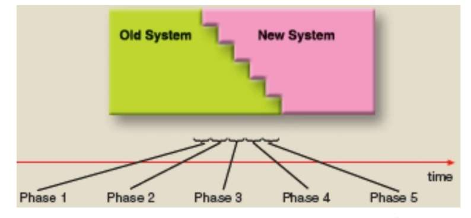
- System implemented in time phases (module by module)
- Direct or parallel run
- Only selected module is satisfied will the remaining module be implemented next in queue
- Advantages
  - Less resource
  - Reduce risk
    - Risk only to implemented modules
  - User Confidence
    - User more confident when see modules successfully implemented
- Disadvantages
  - Slow process
  - Staff demoralised
    - Lose interest
    - User requirement change
  - More expensive
    - Large number of separated phases

# C12 System Operation & Maintenance
## User Support
### User Training
- Teach *existing & new* users use the new system
- Provided when system changed / enhanced
  - Minor
    - Email support
    - User guides
    - Online help facilities
  - Major
    - Formal training

### Help Desks
- IT Personnel who have:
  - Strong technical & interpersonal skills
  - Solid understanding of business
  - Well-trained for the new system
- Help users
  - Answer questions
  - Teach users use system effectively
- ***VS maintenance***
  - Help Desk: Offer help for user to be more effective
  - Maintenance: Provide continous supply of computer resources

### Automated Supports
- How
  - Face to face
  - Online
  - Outside vendor/internal IT staff
- Why
  - Cut cost of providing support
- Eg.
  - Emails
  - FAQs
- Online Support Forums
  - let user get info on bugs
  - Know new releases
  - Tips for effective usage
- Online chat rooms
  - Let lecturer and student meet online
- Online knowledge
- Voice Response Systems
  - Podcasts

### Examples of supports given
- Help user write simple programs
- Install new hardware or software for users
- Help user evaluate a particular software
- Help user submit system proposal
- Help user extract data from database to personal computers
- Set up new user accounts

## System Maintenance
- Adapt: Adapt system to the changing environment
- Correct: Make system opeate correctly
- Perfect: Make system operate efficiently
- Cost: Bath tub curve shape

### Types & Purpose of Maintenance
- #### Perfective
  - Change in user requirements
  - Improve software usability, performance, functionality
  - Eg.
    - Improve performance
    - Meet new requirements
    - Improve layouts
    - Enhance usability
- #### Corrective
  - Correction of errors
  - Fix bugs
  - Make sure programs work correctly
  - Eg.
    - Fix logic errors
    - Update drivers
    - Restore proper config settings
- #### Adaptive
  - Change in computer and business env
    - Hardware / software changes
    - Law and regulation change
  - Eg.
    - Employment law change
    - New systems added
    - Due to business env change
      - create new report
      - add new data entry field
      - install links to website

### Reduce Maintenance Cost
- Thorough analysis of requirements
- Predictive design (predict possible changes)
- Decomposition of programs (modularity)
- Thorough program testing
- Complete documentation
- Use methodology & productive tools

### Software Maintenance Contract
- Between user & software supplier
- Customer pay annual fee
- Specific timeframe
- Services
  - Info about packages
  - Help facilities to help solve problems
  - Updates fix software faults
  - Upgrade to new version at discounted price
  - Legal conditions, customer's responsibilities

### User Groups
- A forum of users of certain hardware or software to share ideas & experience
- Who set up
  - Group of users
    - Unsatisfied with the degree of supports they get
  - Software manufacturers
    - Maintain contact with customers
    - Get new product ideas
- Benefits
  - Get new ideas
  - Feedbacks
  - Middleman (Arbiter) between users and suppliers

# C13 System Development Methodology
## Models
- Representation of some important aspects of real world
- Types
  - Physical: Car model, building model
  - System Development Models: DFD, ERD
  - Project Planning Model

## Techniques
- Guidelines
  - Help analyst complete system development activity or task
- Step-by-step instructions

## Tools
- Software support
  - Help create model or other components
- Software packages
  - CASE tools
  - Diagramming tools
  - Reporting tools
  - IDE
  - Project management tool

## Methodology
- Models
- Techniques
- Tools
- Documentation
- Why
  - Help developer know how docs & techniques fit into stages
  - Increase software quality
  - Better project management and control
    - Adherence to industry standards
  - Standardised Development Process
    - Increased productivity
    - Decreased cost
    - Transferable skills
      - Staff change from one to another
    - Pool of resources
    - Easier maintenance
- Includes a collection of techniques and tools to complete activities

## SDLC
- Features
  - Sequential Stages
  - Deliverables: Each stage's deliverables must be completed before next stage start
  - Completion: Each stage must be complete before next stage start
  - Input: This stage's deliverables act as input for next stage
  - Verification: Documentation for each stage must be verified
  - Freeze stages
- Advantages
  - Sequence stages easy to follow
  - Quality product
  - Good project planning and control
- Disadvantages
  - Hard to estimate resource requirements
  - Hard to say if final system will meet requirements
  - Freeze stage before development is unrealistic
  - Document driven style causes long delay in development

## Package Implementation Stages
### Phase 1 Project Preparation
- Start with *"kick off"* meeting
  - Brief objectives
  - Allocate responsibilities
- Set plan
- Formulate schedule
- Finalize project organisation
- Start training

### Phase 2 Business Process Mapping
- Understand business process
- Know must have which modules
- Make business blueprint
  - Basis for *system config* & *package customization*
    - Config: Reflect organisational structure, business transactions, master data
    - Customisation: Make changes to package

### Phase 3 Realisation
- IT Personnel configure & customise all business process requirement based on Business Blueprint

### Phase 4 Final Preparation
- Run multiple tests
- Provide user training
- Migrate data
- Changeover

### Phase 5 Go Live & Support
- Go Live
  - Move from dev to operation
  - Check again & fine tune system
- Support
  - User & management
  - Run helpdesk

## SSADM
- Structured System Analysis and Design Methodology
- Designed for big projects
- Disciplined & integrated approach to system development
- Standardized approach
- Have clear different phases / stages
- Every stage has its
  - Activities (deliverables)
  - Tools
  - Techniques

## Rapid Application Development
- What
  - Team-based technique
    - Speed up IS development
  - Collection of development approaches, techniques, tools
  - Combine Prototyping, computer-based development tools, special management practices, close user involvement
  - Reaction to problems of traditional developments
- Why
  - Reduce cost & development time
  - Increase success chance

```
Requirements planning -> User Design <-> Construction -> Cutover
```

### Requirements Planning
- System Planning + System Analysis
- Users, manager, IT staff discuss & agree on
  - business needs
  - scope
  - constraints
  - requirements

### User Design
- User interact with System Analyst
- Models and prototypes developed
- Continuous and interactive process
- Translate user needs into working models

### Construction
- Program development
- User participate and suggest changes

### Cutover
- Implementation
- Data conversion
- Changeover
- User Training

## Challenges in System Development
- How to reduce development time
- How to increase quality of new IS
- Growing demands
- Automated tools can't reduce pressure

## Common Software Development Problems
- High maintenance cost
- Reduced Software Trust
  - People sus machine easily get error
- Software Reliability
- Increased Demands
- Poor Quality
- Poor Delivery
- High Software Cost
- No Meet User's Needs
- Software Portability

<!-- empty h1 for line on top -->
<h1></h1>
<h1 
  style="text-align:center"
>
  LES FKING GO
</h1>
