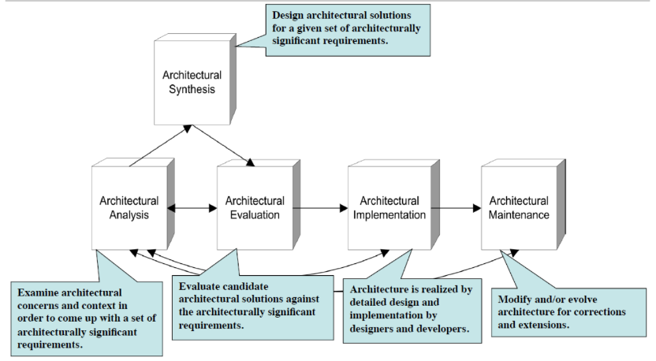

# C1
## software architecture is a set of structure needed to reason the system, which comprise software elements, relations among them and property of both
> what can you derive from a software architecture (question that ask using the quote)
  - Architecture is an abstraction, every software system has a software architecture and architecture includes behavior (can expand out lai say)
  - Software architecture is a set of structure
    - Structure => a collection of elements linked by a relationship
    - not every structure is designed to be architectural, only those that help reason about the system and its property can be considered architectural
  - Software architecture is an abstraction
    - Help pick part of system to prioritize, excluding details that don't affect overall composition
    - Focus on software components (classes etc) and their interaction
    - Essential for managing complexity
      - enable viewing the system in terms of its components
        - How they are organized
        - How they interact
        - What attributes they have
  - Every system has an architecture
    - Every system have components and relationships between them, which form the structures and architecture is just a set of structures
    - All system will have an architecture, but not anyone can fully understand them
  - Architecture includes behavior
    - Capture how components interact with each other
  - Not all architecture is a good architecture

## Architecture LifeCycle
> Architecture analysis -> architecture synthesis -> architecture evaluation -> architecture implementation -> architecture maintenance (normal flow)

  - Architecture analysis
    - Examine architectural concerns and context in order to come up with a set of architecturally significant requirements
  - Architectural synthesis
    - Design architecture solution for the architecturally significant requirements
  - Architectural evaluation
    - Evaluate the architecture solution against the architecturally significant requirements
  - Architectural implementation
    - Implement the architecture by designer and developer with detailed design
  - Architectual maintenance
    - Modify and/or evolve architecture for correction and extensions

# C2
## Kruchten view model 4+1 (logical, process, implementation, deployment + scenarios) know all the connection
  - Logical (Design View)
    - Show key abstraction in the system as objects or object classes (module structure)
    - Support functional requirement (what system should provide)
    - Abstraction, encapsulation, inheritance
    - Viewer: end user
    - Representation: Class diagrams, class categories, class utilities
  - Process View
    - Consider concurrency and distribution of functionality (component and connector structure)
    - Show at run-time how system is composed of interacting process
    - Considers some non-functional requirements like performance and availability
    - Viewer: Integrators
    - Representation: Different level of abstractions (processes/threads, major/minor tasks, communication mechanisms)
  - Development (Implementation)
    - Organize software modules, libraries, subsystems and units of development (allocation structure)
    - Show how the software is decomposed for development
    - Focus on actual software module organization on the software development environment
    - Viewer: Programmer and software managers
    - Representation: Layered Style
  - Physical (Deployment) (I oso confuse for this one)
    - Map element to processing and communication
    - Map software to hardware
    - Show how software component distributed across processors in the system
    - Consider primarily non-functional requirements (availability, reliability, performance, scalability)
    - Elements identified (networks, processes, tasks, objects)
    - Viewer: System Engineers
    - Representation: Various forms (words, notations) over the process view
  - Scenarios (Use Case View)
    - The "plus one"
    - Considers system consistency and validity
    - a set of key use cases that serve as 
      - a driver to discover architectual elements during architecture design 
      - to validate the structures are not in conflict with each other and when work together, describes a system meeting its requirements
    - Viewer: All user of other views + Evaluators
    - Representation: Similar to logical view but with a few variations

Diagrams used in the 4+1 View Model
| View | Notations |
|:--|:--|
| Logical View | Class diagram, Object diagram, Sequence diagram, Communication diagram, State diagram |
| Process View | Activity Diagram |
| Development / Implementation View | Component diagram, Package diagram |
| Physical View | Deployment Diagram |
| Use case View | Use case diagram |

## which architecture design emphasis on different abstraction level, grouping the related process
> how to draw architecture diagram
  - Layered Architecture
    - Group related functionalities in an application into distinct layers
    - Each layer provides services to the one above it and uses services from the layer below
    - Layers are modules with a cohesive set of services through well-defined interfaces
    - Three-Layered System: Commonly used in business systems, divided into Presentation, Business, and Data Access Logic layers
    - Literally said in advantages for it's abstraction

# C3
## Don't overspecify the design (reason)
> she give eh answer when MTT Revision, but to me this more like how to not overspecify or like when we can know that we are overspecifying
  - Detailed design is expressed entirely by programming language, when you use programming language, it can be too complex, unneccessary information will be captured
  - Detailed design is expressed entirely in natural language, it can easily slip into ambiguity and inconsistency of the requirement of the stakeholder
## Software engineer insist to create design model before coding (or to have a clear understand of requirement before coding, see tutorial)
  - Quality assurance: Identify potential issues of the potentially problematic areas by outlining the system structure and flow.
  - Change management: Future changes or additions can be integrated more smoothly if there is a clear design model to follow
  - Communication and stakeholder alignment: Ensure everyone has the same understanding of the software's structure and functionality

# C5
## Common issue in concurrent system
  - Concurrency = tendency for things to happen at the same time in a system
  - System team member is not very experienced in concurrency design
  - Understanding of system concurrency is very slow
  - Fragile concurrency architecture is hard to understand
  - Software engineer and manager mistakenly think object oriented analysis will guarantee a good concurrent software design
  - Marketing group has a wrong system throughput assumption and commitment at the beginning of a project
  - Almost all design do not have clear distinction between code controlling system resource operation and code performing system resource concurrency
## Definition of handle and controlling event (david garlan and mary shaw)
  - Implicit invocation
      - Idea: instead of calling a procedure (function) directly, a component can broadcast one or more events and other components registered to that event will decide which procedures to call when the event is fired
## Distinguish between implicit invocation and callback
  - Implicit invocation
    - High cohesion, low coupling
    - Systems driven by events
    - events are triggered whenever system needs to do something
  - Callback
    - A piece of executable code passed as an argument to other code
    - Invocation may be synchronous (happen immediately) or asynchronous (happen later)
    - Used to program application in windowing systems
    - Idea: Application supply a call back function for the operating system to call, the OS call this function in response to events
- 4 elements of implicit invocation
